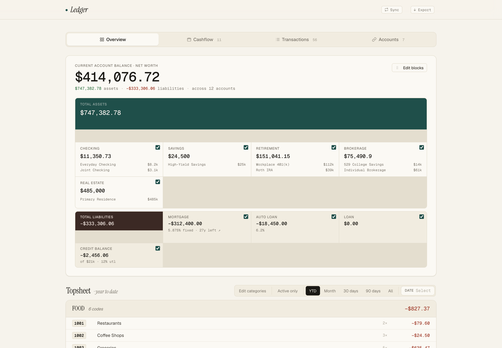
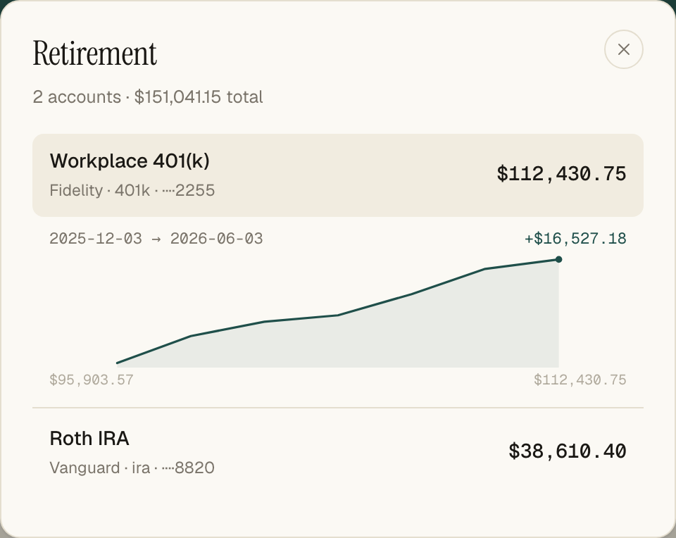
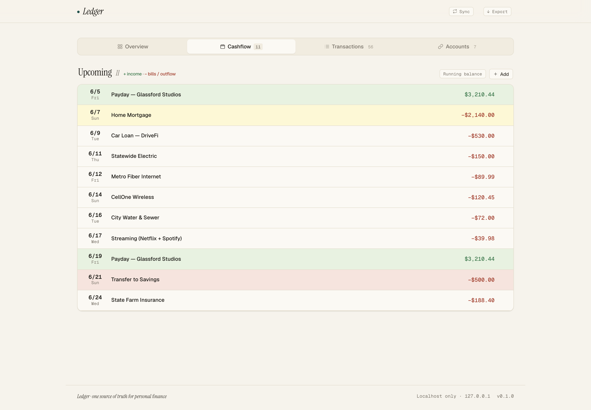
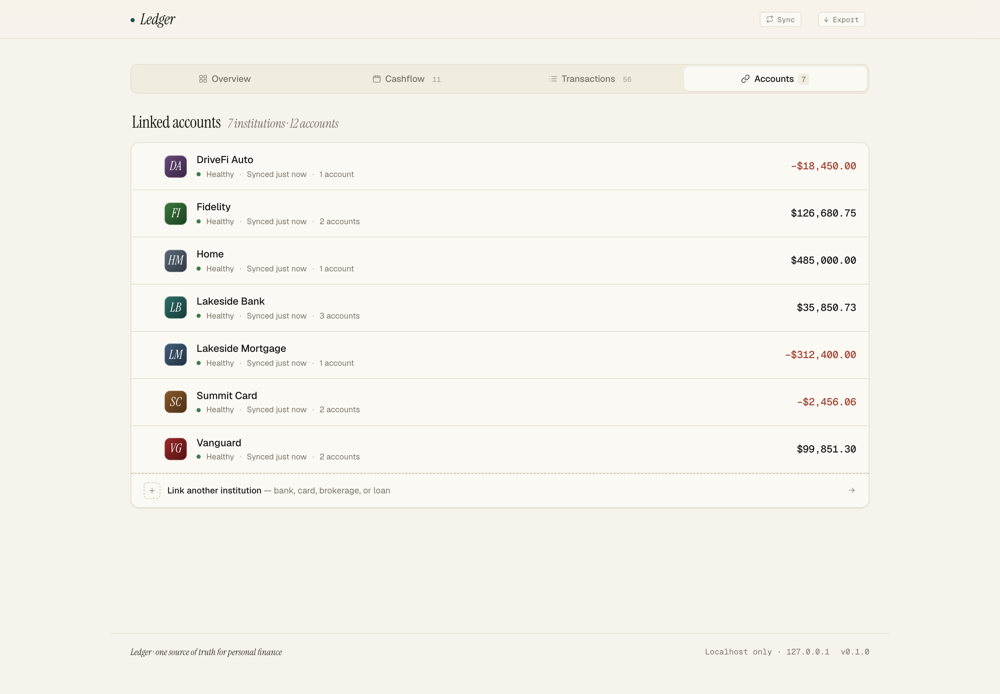

<div align="center">

# Ledger

**A Claude-native personal finance dashboard.**

The web app is the source of truth (Bun + SQLite + a small REST API).
Claude is the integration layer — it pulls transactions from Plaid, reconciles
Amazon/Target charges against real order data, codes everything to your chart of
accounts, and writes back through the API. You drive it with slash commands; the
GUI is where you read, verify, and adjust.




</div>

```
┌───────────────┐   MCP    ┌───────────────┐   REST    ┌────────────────────┐
│ Plaid / Amazon │ ───────▶ │    Claude     │ ────────▶ │  Ledger app         │
│ Target  (MCP)  │  tools   │ (Claude Code) │   /api    │  Bun + SQLite + UI  │
└───────────────┘          └───────────────┘           └────────────────────┘
```

---

## Highlights

**Net worth that drills down.** Accounts roll up into customizable asset/liability
blocks. Click a block that holds more than one account to break it out — then
expand any account for its balance history. Mortgages show amortization (rate ·
years left), credit cards show utilization, and investment accounts are kept out
of the spending math automatically.



**Cashflow you can read at a glance.** Upcoming inflows and outflows on one
signed timeline — `+` income (green), `−` bills/outflow (red), transfers and
paydays tagged. Pick which cash accounts to plan against and it projects a
running balance, flagging the day you'd go negative.



**A spending topsheet that doesn't lie.** Income and transfers are flagged
`spending: false` in the chart of accounts and excluded from the "net for
period" deterministically — so a paycheck or a credit-card payment can never
flatter or wreck your spend totals. Period presets (YTD / month / 30d / 90d) and
an "active only" toggle.

**Linked accounts, the way you'd organize them.** Drag to reorder, nickname,
reassign an account to a different net-worth block, all inline.



### Decoding the Amazon charge from hell

`AMZN MKTP US*2K4XY` — **$84.34**. What *was* that? Your statement won't tell you,
Amazon's order list shows a **$356** order, and the math doesn't add up. This is
the single most annoying part of categorizing real spending, and Ledger ships a
dedicated MCP server (`mcp/amazon-orders`, plus `mcp/target-orders`) that solves it:

- **Order total ≠ what hit your card.** Gift cards, rewards points, and
  Subscribe & Save discounts shrink the charge — that $356 order becomes an $84.34
  charge. `amazon_reconcile_charge` pulls the **actual invoice grand total** and
  matches on *that*, not the sticker price.
- **Three separate billing systems.** Physical orders, digital (Kindle/Music/
  Audible), and Prime membership each bill differently. The reconcile tool searches
  all three so a mystery charge can't hide in the one you forgot to check.
- **Charge date ≠ order date.** Subscribe & Save bills when an item *ships*, often
  1–2 weeks later — so it uses a lookback window instead of exact-date matching.
- **Then it splits the transaction** into the line items that were actually on the
  order, so a single Amazon charge lands in Groceries + Household + Kids, not one
  vague "Shopping" bucket.

Same idea for Target (`target-orders`). Twelve Amazon tools in all — search, invoices,
returns/refunds, package tracking — run locally over your own session, nothing sent
to a third party. *(These MCP servers stand on their own and may ship as a separate
release; for now they're bundled here.)*

### Built for humans *and* agents

The GUI is for reading and correcting. The *work* — pulling transactions,
reconciling an ambiguous Amazon charge against the actual invoice, coding to a
180-line chart of accounts — is done by Claude through bundled MCP servers and a
set of skills. Everything an agent does is a plain REST call; every mutation is
audit-logged; and the API refuses to let the AI overwrite anything you coded by
hand. Agents read [`CLAUDE.md`](CLAUDE.md) to learn the API (including auth) and
the cold-start path.

---

## Try it now (sample data)

See the whole app alive in 30 seconds — no Plaid account needed. Seeds a fully
fictional household (accounts, ~60 coded transactions, cashflow, balance history):

```bash
bun install
bun run seed:demo     # fictional demo data
bun run dev           # http://localhost:7815
```

Start fresh instead? `bun run seed && bun run dev` gives you an empty dashboard
that tells you to ask Claude (or link a bank) — see [Cold start](#the-claude-workflow).

---

## Requirements

| Dependency | Why | Notes |
|---|---|---|
| [Bun](https://bun.sh) ≥ 1.2 | runtime, bundler, test runner, SQLite | `curl -fsSL https://bun.sh/install \| bash` |
| [Rust](https://rustup.rs) (cargo) | builds the bundled Amazon/Target MCP servers | only needed for Amazon/Target reconciliation |
| A [Plaid](https://plaid.com) account | bank/card/brokerage data | free **sandbox** to start; production needs Plaid approval |
| [Claude Code](https://claude.com/claude-code) | drives the sync/code/reconcile workflow | optional — the app also works with manual entry + the demo seed |
| [1Password CLI](https://developer.1password.com/docs/cli/) (`op`) | **optional** secret store for Plaid creds + tokens | only if you don't want secrets in a `.env` |

**MCP servers ship with the repo** — no extra repos to clone. `.mcp.json` wires
all three for Claude Code automatically:
- `plaid-mcp` — `src/plaid` (TypeScript, runs under Bun).
- `amazon-orders`, `target-orders` — `mcp/` (Rust; built on first use via `cargo run`).

Amazon/Target read your session cookies from `AMAZON_COOKIES` / `TARGET_COOKIES`
(paths to a cookies file), else `~/.config/{amazon,target}-orders/cookies.txt`,
else your local Chrome cookie store. Reconciliation is optional.

---

## Quick start (your own data)

```bash
bun install
cp .env.example .env          # set PLAID_ENV=sandbox + creds (see below)
bun run seed                  # seed the line-code catalog from the active profile
bun run dev                   # build + serve at http://localhost:7815
```

The database (`data/ledger.db`) is created and migrated on first run. With
**sandbox** credentials you can link Plaid's test institutions and see the full
app immediately.

---

## Plaid credentials

The app needs a Plaid `client_id` and `secret`. Two ways to provide them — pick one.

### Path A — environment variables (simplest)

In `.env`:

```bash
PLAID_CLIENT_ID=your_client_id
PLAID_SECRET=your_sandbox_secret
PLAID_ENV=sandbox
```

That's it. Skip the 1Password section.

### Path B — 1Password (`op`) — no plaintext secrets on disk

This is how the project runs by default when the env vars above are unset. It
keeps Plaid credentials **and** the per-bank access tokens out of files.

1. **Install + sign in** to the [1Password CLI](https://developer.1password.com/docs/cli/get-started/):
   ```bash
   brew install 1password-cli
   op signin
   ```
2. **Create a vault** named `Plaid`.
3. **Add an item** named `plaid-api` (type: API Credential or Login) with these
   fields:
   | field | value |
   |---|---|
   | `client_id` | your Plaid client id |
   | `sandbox_secret` | your Plaid sandbox secret |
   | `production_secret` | your Plaid production secret (if/when approved) |

   The app reads `sandbox_secret` when `PLAID_ENV=sandbox`, `production_secret`
   when `production`.
4. **Access tokens** (the credentials that actually reach your linked accounts)
   are written by the app to a `plaid-mcp-tokens` item in the same `Plaid` vault,
   with a local fallback at `~/.config/plaid-mcp/tokens.json` if 1Password isn't
   reachable. Nothing token-related is ever stored in the repo.
5. **Non-interactive / headless** (recommended): create a
   [1Password **service account**](https://developer.1password.com/docs/service-accounts/)
   with read/write access to the `Plaid` vault, and put its token in `.env`:
   ```bash
   OP_SERVICE_ACCOUNT_TOKEN=ops_...
   ```
   Without it, `op` will prompt for interactive auth on each read.

> Sandbox vs production: `PLAID_ENV` controls which secret is used and **defaults
> to sandbox**. Production access is gated by Plaid and billed per developer
> account — open-sourcing this code never exposes or bills *your* account, since
> every credential is read from env/1Password and is gitignored.

---

## The Claude workflow

With the MCP servers connected in Claude Code (all three are bundled), the
project ships skills/slash commands that orchestrate everything:

- **`/ledger-setup`** — cold start: bring a fresh, empty clone to a populated dashboard.
- **`/ledger-sync`** — pull new Plaid transactions, dedupe, insert, refresh balances.
- **`/ledger-code-transactions`** — assign line codes to uncoded transactions.
- **`/ledger-reconcile-amazon`** — match Amazon/Target charges to real orders and split them.
- **`/home-value`** — estimate a property from nearby comps and save it.

Everything they do is also a plain REST call (`/api/...`), and the whole app is
scriptable from the browser console via `window.Ledger`.

---

## Profiles

`profiles/default.json` (shipped) defines the net-worth blocks, the Plaid
subtype→block map, and the line-code catalog. To customize without touching the
repo, copy it to `profiles/local.json` (gitignored) and select it:

```bash
LEDGER_PROFILE=local bun run seed
LEDGER_PROFILE=local bun run dev
```

Blocks and codes are also editable live in the UI (Overview → *Edit blocks* /
*Edit categories*).

---

## Backups

`scripts/install-backup.sh` installs a macOS LaunchAgent that takes a daily,
WAL-safe SQLite snapshot into `data/backups/` (newest 14 kept). `data/` is
gitignored — your financial data never leaves your machine.

---

## Security model

Ledger holds financial data, so it's built to be safe on a personal machine and
was red-teamed (live HTTP + headless-browser attacks, MCP/TLS probes, and an
adversarial multi-model code review) before release.

- **Localhost only** — binds `127.0.0.1`; not reachable off the machine.
- **Per-session API token** (timing-safe compare) on every `/api` call, plus
  Origin + Host allowlists (defeats CSRF and DNS-rebinding) and `Content-Security-Policy`
  + `X-Frame-Options: DENY` (defeats clickjacking).
- **No secrets in the repo** — `.env`, the SQLite DB, and cookies are gitignored
  and never committed; a pre-commit hook scans staged content. Plaid secrets are
  redacted from any error output. Cloners bring their own credentials.
- **Parameterized SQL**, path-traversal-guarded static serving, request-body and
  bulk-array size caps.
- **Agent trust boundary** — the data Claude ingests (Plaid/Amazon/Target
  merchant names and order text) is **untrusted input**. The skills treat it as
  data, never as instructions; destructive actions require the amounts to
  reconcile; every mutation is audit-logged and manually-coded transactions
  can't be overwritten by the AI.

Residual notes: the API token lives in the page DOM (only readable same-origin),
and the CSP allows the React (SRI-pinned) and Plaid CDNs — a compromise of an
allowlisted CDN could read the token. Run with `PLAID_ENV=sandbox` unless you've
been approved for production.

---

## Development

```bash
bun test           # full suite (server integration + headless-browser UI tests)
bun run build      # bundle the frontend
bun run seed:demo  # fictional sample data for a populated dashboard
```

Secrets are never committed (`.env`, `data/`, and `profiles/local.json` are
gitignored); Plaid secrets are redacted from any error output.

## Contributing

PRs welcome — `main` is protected, so changes land via pull request. The highest-
value contribution is a **new order-history MCP server for another retailer**
(Home Depot, Walmart, Costco, Best Buy, Instacart…) following the
`mcp/amazon-orders` / `mcp/target-orders` pattern, so charge reconciliation works
beyond Amazon and Target. See [CONTRIBUTING.md](CONTRIBUTING.md).

## License

[MIT](LICENSE) © David Sadofsky
